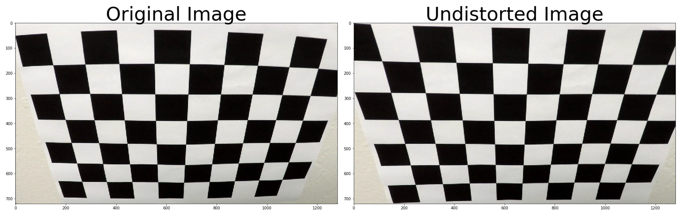
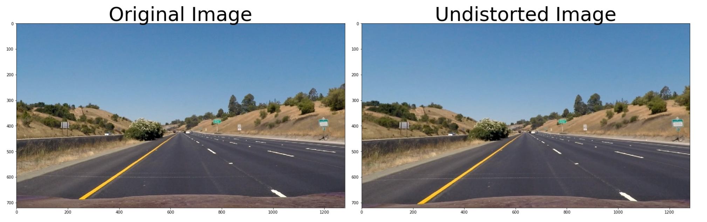
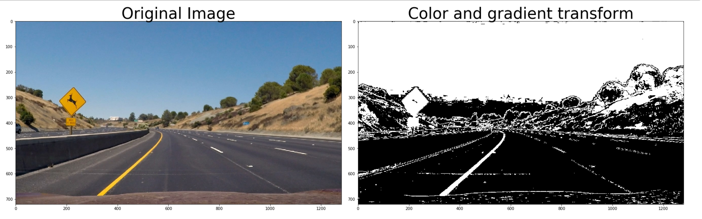
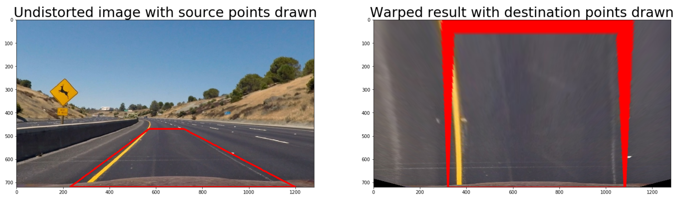
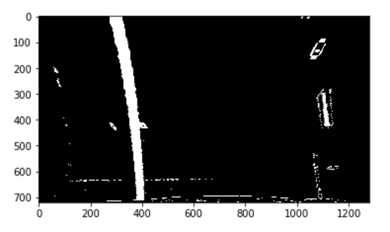
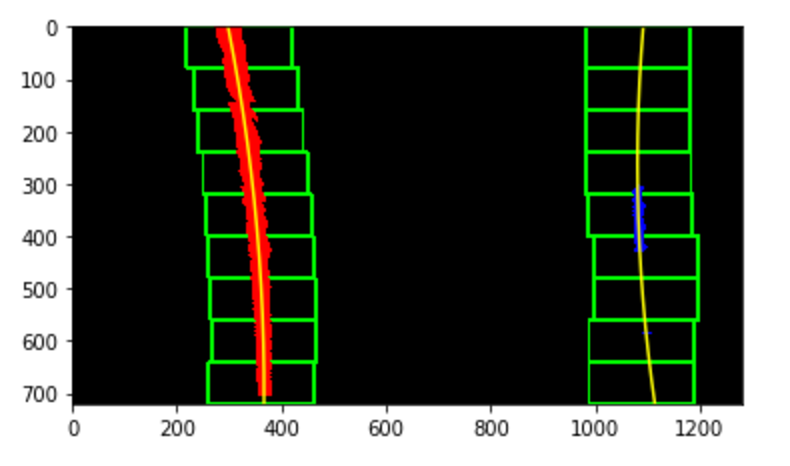
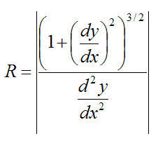
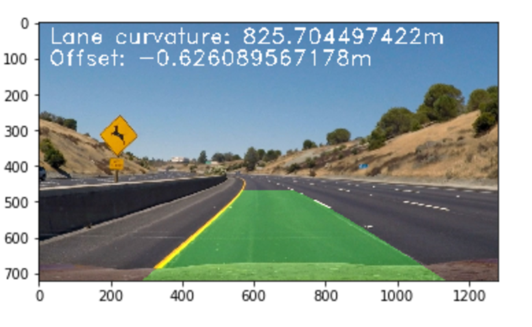

**Advanced Lane Finding Project**

The goals / steps of this project are the following:

* Compute the camera calibration matrix and distortion coefficients given a set of chessboard images.
* Apply a distortion correction to raw images.
* Use color transforms, gradients, etc., to create a thresholded binary image.
* Apply a perspective transform to rectify binary image ("birds-eye view").
* Detect lane pixels and fit to find the lane boundary.
* Determine the curvature of the lane and vehicle position with respect to center.
* Warp the detected lane boundaries back onto the original image.
* Output visual display of the lane boundaries and numerical estimation of lane curvature and vehicle position.

[//]: # (Image References)

[image1]: ./examples/undistort_output.png "Undistorted"
[image2]: ./test_images/test1.jpg "Road Transformed"
[image3]: ./examples/binary_combo_example.jpg "Binary Example"
[image4]: ./examples/warped_straight_lines.jpg "Warp Example"
[image5]: ./examples/color_fit_lines.jpg "Fit Visual"
[image6]: ./examples/example_output.jpg "Output"
[video1]: ./project_video.mp4 "Video"

## [Rubric](https://review.udacity.com/#!/rubrics/571/view) Points

### Here I will consider the rubric points individually and describe how I addressed each point in my implementation.  

---

### Writeup / README

#### 1. Provide a Writeup / README that includes all the rubric points and how you addressed each one.  You can submit your writeup as markdown or pdf.  [Here](https://github.com/udacity/CarND-Advanced-Lane-Lines/blob/master/writeup_template.md) is a template writeup for this project you can use as a guide and a starting point.  

You're reading it!

### Camera Calibration

#### 1. Briefly state how you computed the camera matrix and distortion coefficients. Provide an example of a distortion corrected calibration image.

The code for this step is contained in the second code cell of the IPython notebook located in “./lane_finding.ipynb". Here I defined a function called `calibrate()`. This function receives no params and returns the distorsion coefficients and the camera matrix among other values. These two values will be used to undistord the images.  

I start by preparing "object points", which will be the (x, y, z) coordinates of the chessboard corners in the world. Here I am assuming the chessboard is fixed on the (x, y) plane at z=0, such that the object points are the same for each calibration image.  Thus, `objp` is just a replicated array of coordinates, and `objpoints` will be appended with a copy of it every time I successfully detect all chessboard corners in a test image.  `imgpoints` will be appended with the (x, y) pixel position of each of the corners in the image plane with each successful chessboard detection.  

I then used the output `objpoints` and `imgpoints` to compute the camera calibration and distortion coefficients using the `cv2.calibrateCamera()` function.  
After getting the calibration values, I apply the received values to undistord a test image with `cv2.undistort()`, and obtained this result:

### Pipeline (single images)

#### 1. Provide an example of a distortion-corrected image.

To demonstrate this step, I will describe how I apply the distortion correction to one of the test images like this one:

#### 2. Describe how (and identify where in your code) you used color transforms, gradients or other methods to create a thresholded binary image.  Provide an example of a binary image result.

I used a combination of color and gradient thresholds to generate a binary image. The code can be found in the second cell. As a color space I used HLS, which give me quite good result from the start. I used channel L (to help me with shadows), to get the magnitud of the gradient. And combined this binary with the S channel, that alread gives a very good result in the image tests. Combinaning this two binaries, the result works very good with different color lanes and the color of the highway. Here is an example:

#### 3. Describe how (and identify where in your code) you performed a perspective transform and provide an example of a transformed image.

The code for my perspective transform includes a function called `warp()`, which appears in the 3rd code cell of the IPython notebook).  The `warp()` function takes as inputs an undistorted image (`img`). I chose the hardcode the source and destination points in the following manner:

| Source        | Destination   | 
|:-------------:|:-------------:| 
| 570, 470      | 320, 0        | 
| 720, 470      | 1080, 0      |
| 1130, 720     | 1080, 720      |
| 200, 720      | 320, 720        |

I verified that my perspective transform was working as expected by drawing the `src` and `dst` points onto a test image and its warped counterpart to verify that the lines appear parallel in the warped image.

#### 4. Describe how (and identify where in your code) you identified lane-line pixels and fit their positions with a polynomial?

Once we have a thresholded and prespective transformed image, we can locate the lane lines and fit a polynomial. Having an image like this:

With this image, our first step is use `histogram` to discover the peaks in the image, which will be the lane lines.

![histogram][./writeup_images/histogram.png]

Next step is using `sliding windows`, we detect the lane lines for each window. We divide vertically the image in x number of windows (9 in our case). For each window we detect the non zero pixels inside the window, and move it right or left depending on the result. With this info we can extract the left and right line pixel position and find a second order polynomial. Here is an example of the previous image with the windows drawn:

The code for this step is in cell number 7, in method `getPolyline`.

#### 5. Describe how (and identify where in your code) you calculated the radius of curvature of the lane and the position of the vehicle with respect to center.

Once we have the polynomials we can calculate the curvature. The code is in cell number 5. But before we can do that we need to go back to the real world space. For that we need to assume a couple of values, the lane long and the lane width. 30 meters and 3.7 meters respectively. With these values we calculate the new polynomial for the real world. And then apply the radius of curvature formula:

To get the position of the vehicle with respect the center, we use the bottom part of the image. We get the center of the lane and we compare this value with the center of the image. The code is in cell number 6, in method `offset`.

#### 6. Provide an example image of your result plotted back down onto the road such that the lane area is identified clearly.

I implemented this step in lines cell number 8. We need to pass to this method an binary warped image. The result of this step in a test image is like this:

---

### Pipeline (video)

#### 1. Provide a link to your final video output.  Your pipeline should perform reasonably well on the entire project video (wobbly lines are ok but no catastrophic failures that would cause the car to drive off the road!).

Here's a [link to my video result](./output.mp4)

---

### Discussion

#### 1. Briefly discuss any problems / issues you faced in your implementation of this project.  Where will your pipeline likely fail?  What could you do to make it more robust?

There are a few mometns in the video, where the area is not correctly drawn. Currently I am trying to avoid this issue by measuring the width of the lane in every moment. And when I get a value very different to the average, I will not draw the area on that image and return the undistorted image. 
I had also quite some go and back with the threshold, and what apparently worked perfectly in test images, in the video gave a really bad result. Actually one of my best approaches was just using channel S from HLS color space. 
Once I improved this two points, I think my solution could performs better in the challenge video. Right now the performance is quite poor, most likely because all the changes in light and shadows on the road. 
